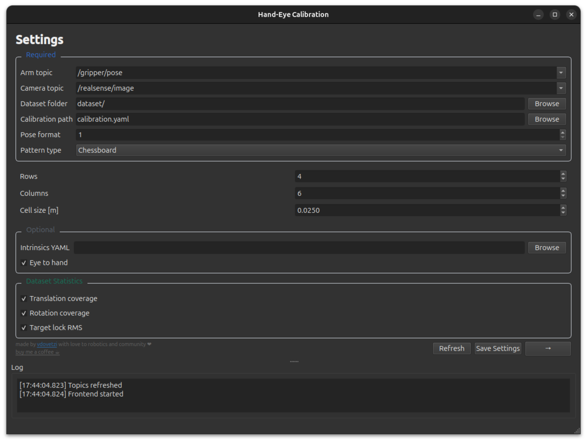
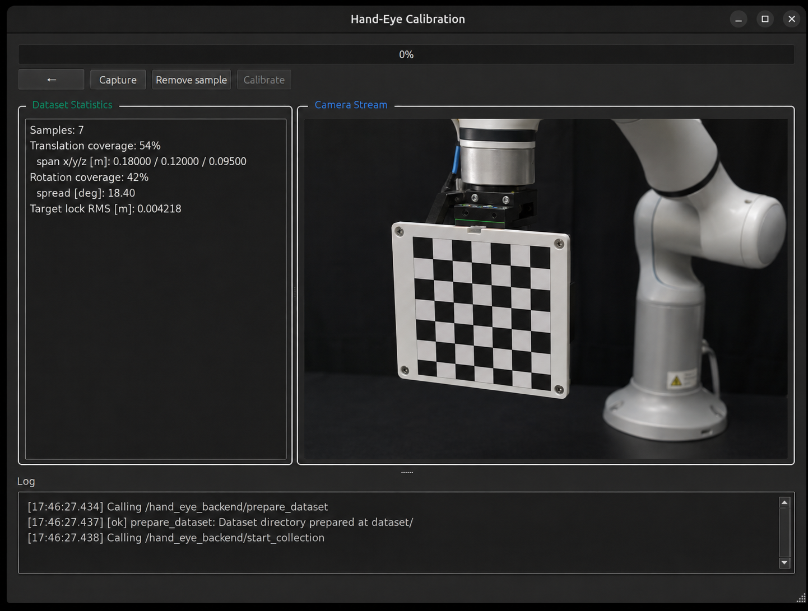

# Hand-Eye Calibration

[](https://sonarcloud.io/summary/new_code?id=vdovetzi_hand_eye_calibration)
[](https://sonarcloud.io/summary/new_code?id=vdovetzi_hand_eye_calibration)
[](https://sonarcloud.io/summary/new_code?id=vdovetzi_hand_eye_calibration)
[](https://sonarcloud.io/summary/new_code?id=vdovetzi_hand_eye_calibration)


ROS 2 package for collecting calibration datasets and computing **hand-eye
calibration** from robot poses and camera images.






## Features

- CLI tools for dataset collection, calibration, and validation.
- `hand_eye_backend` ROS node with services for a combined application flow.
- Qt `hand_eye_frontend` app
- Camera preview with detected pattern overlay.
- Live dataset statistics:
  - translation coverage;
  - rotation coverage;
  - Target lock RMS.
- Arm messages are read through `ros_babel_fish`, so the backend can inspect
  topic types at runtime.

## Build

From your ROS 2 workspace:

```bash
rosdep install --from-paths src --ignore-src -r -y
colcon build --packages-select hand_eye_calibration --symlink-install
source install/setup.bash
```

For development builds:

```bash
colcon build \
  --packages-select hand_eye_calibration \
  --symlink-install \
  --cmake-args \
    -DCMAKE_BUILD_TYPE=Debug
```

Sanitizers are enabled by default in Debug builds and can be controlled with:

```bash
colcon build \
  --packages-select hand_eye_calibration \
  --symlink-install \
  --cmake-args \
    -DCMAKE_BUILD_TYPE=Debug \
    -DUSE_SANITIZERS=OFF
```

## App Workflow

Start the backend:

```bash
ros2 run hand_eye_calibration hand_eye_backend
```

Start the frontend:

```bash
ros2 run hand_eye_calibration hand_eye_frontend
```

The app opens on the Settings screen.

Required settings:

- **Arm topic**: robot/gripper pose source.
- **Camera topic**: camera image source.
- **Dataset folder**: output folder for captured images and `poses.csv`.
- **Calibration path**: output YAML path, defaulting to `calibration.yaml`.
- **Pose format**: how each row in `poses.csv` is interpreted.
- **Pattern type**: ArUco, chessboard, or ChArUco.

Optional settings:

- **Intrinsics YAML**: camera intrinsics. If empty, intrinsics are estimated from
  the dataset where possible.
- **Eye to hand**: enable for eye-to-hand setups; disable for eye-in-hand.

After pressing **Next**, the workflow screen shows capture controls, the camera
stream, detected pattern points, selected statistics, and the log panel.

Use:

- **Capture** to save the current image and arm pose.
- **Remove sample** to delete the latest saved image and pose row.
- **Calibrate** to compute and save the hand-eye transform.

If the dataset folder already exists, the app asks whether to continue the
dataset or start over.

## Dataset Layout

Captured datasets use this structure:

```text
dataset/
  images/
    0.png
    1.png
    2.png
  poses.csv
```

`poses.csv` is written as tab-separated values. For pose-space calibration,
supported pose formats are:

```text
1: x y z qx qy qz qw
2: x y z qw qx qy qz
3: x y z roll pitch yaw [rad]
4: x y z roll pitch yaw [deg]
5: x y z yaw pitch roll [rad]
6: x y z yaw pitch roll [deg]
7: joint positions j0 j1 ... jn
```

Joint-state calibration is recognized in the UI, but pose-space calibration
statistics and calibration from joints are not implemented yet.

## Pattern Parameters

The app exposes pattern-specific fields. The CLI tools use the compact
`pattern_info` format:

```text
ArUco:         "1 <dictionary> <marker_id> <marker_size_m>"
Chessboard: "2 <rows> <cols> <cell_size_m>"
ChArUco:    "3 <rows> <cols> <cell_size_m> <marker_size_m> <dictionary> <marker_id>"
```

Examples:

```bash
--pattern-type "2 6 9 0.025"
--pattern-type "1 4 12 0.04"
```

For chessboards, `rows` and `cols` are the number of inner corners.

## Dataset Statistics

The frontend shows only the statistics selected on the Settings screen.

### Translation Coverage

Translation coverage measures how well saved gripper positions cover translation
space.

### Rotation Coverage

Rotation coverage measures orientation diversity around the gripper.

### Target Lock RMS

Target lock RMS estimates how much the calibration target origin moves in the
gripper frame. If the target is rigidly attached to the gripper, this value
should be close to zero.

## CLI Tools

The separate nodes are still available.

Collect a dataset:

```bash
ros2 run hand_eye_calibration dataset_collector \
  --arm-topic "/gripper/pose" \
  --image-topic "/camera/color/image_raw" \
  --dataset-path "dataset" \
  --pattern-type "2 6 9 0.025"
```

Compute calibration:

```bash
ros2 run hand_eye_calibration compute_calibration \
  --dataset-path "dataset" \
  --poses-format 1 \
  --pattern-type "2 6 9 0.025"
```

Validate calibration:

```bash
ros2 run hand_eye_calibration validate_calibration \
  --dataset-path "dataset" \
  --calibration-path "calibration.yaml" \
  --pattern-type "2 6 9 0.025"
```
